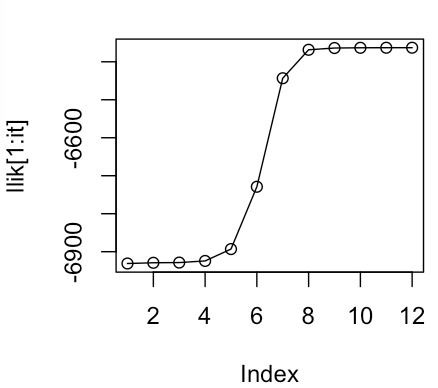
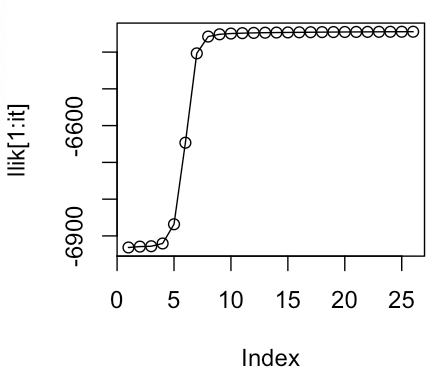
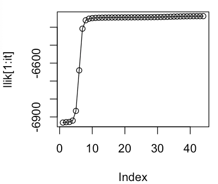

```{r setup, include=FALSE}
knitr::opts_chunk$set(echo = TRUE)
```

# Assignment 1

# Assignment 2
# Comparison of Mixture Model with Different Number of Clusters (\( M \))

The EM algorithm was run for a Bernoulli Mixture Model with different values of \( M \) (number of clusters), specifically \( M = 2 \), \( M = 3 \), and \( M = 4 \). The objective was to analyze how the number of clusters influences the model's behavior, particularly its impact on the log-likelihood values and the convergence process.

## Experimental Setup

- **Number of Data Points (\( n \)):** 1000
- **Number of Features (\( D \)):** 10
- **Maximum Iterations (\( \text{max\_it} \)):** 100
- **Minimum Change in Log-Likelihood (\( \text{min\_change} \)):** 0.1
- **True Mixture Components (\( \text{true\_pi} \)):** \( [1/3, 1/3, 1/3] \)
- **True Conditional Distributions (\( \text{true\_mu} \)):** 
  - Cluster 1: \( [0.5, 0.6, 0.4, 0.7, 0.3, 0.8, 0.2, 0.9, 0.1, 1] \)
  - Cluster 2: \( [0.5, 0.4, 0.6, 0.3, 0.7, 0.2, 0.8, 0.1, 0.9, 0] \)
  - Cluster 3: \( [0.5, 0.5, 0.5, 0.5, 0.5, 0.5, 0.5, 0.5, 0.5, 0.5] \)

## Results

### \( M = 2 \) (Too Few Clusters)

- **Final Log-Likelihood:** \(-6362.897\)
- **Number of Iterations for Convergence:** 12
- **Mixing Coefficients (\( \pi \)):** 
  - Cluster 1: 0.4971
  - Cluster 2: 0.5029
- **Observed Behavior:** The log-likelihood converged quickly, but the two clusters attempted to merge three distinct distributions into two groups, leading to suboptimal modeling of the true data.



---

### \( M = 3 \) (Ideal Number of Clusters)

- **Final Log-Likelihood:** \(-6344.57\)
- **Number of Iterations for Convergence:** 26
- **Mixing Coefficients (\( \pi \)):** 
  - Cluster 1: 0.3417
  - Cluster 2: 0.2690
  - Cluster 3: 0.3893
- **Observed Behavior:** The log-likelihood achieved a higher value, indicating a better fit to the data. The three clusters accurately represented the true data distribution.



---

### \( M = 4 \) (Too Many Clusters)

- **Final Log-Likelihood:** \(-6338.228\)
- **Number of Iterations for Convergence:** 44
- **Mixing Coefficients (\( \pi \)):**
  - Cluster 1: 0.1547
  - Cluster 2: 0.1419
  - Cluster 3: 0.3514
  - Cluster 4: 0.3520
- **Observed Behavior:** The model overfits the data by creating additional clusters that attempt to segment the data unnecessarily. This results in a marginal improvement in log-likelihood but at the cost of increased complexity.



---


While the log-likelihood improves as the number of clusters increases, the additional clusters for \( M = 4 \) do not significantly enhance the fit, indicating overfitting. The ideal choice of \( M = 3 \) aligns with the true distribution and balances model complexity and fit quality.


# Assignment 3

# Appendix
## Asssignment 1

## Asssignment 2
```{r Asssignment_2, echo=TRUE, eval=FALSE}
set.seed(1234567890)
max_it <- 100 # max number of EM iterations
min_change <- 0.1 # min change in log likelihood between two consecutive iterations
n=1000 # number of training points
D=10 # number of dimensions
x <- matrix(nrow=n, ncol=D) # training data

true_pi <- vector(length = 3) # true mixing coefficients
true_mu <- matrix(nrow=3, ncol=D) # true conditional distributions
true_pi=c(1/3, 1/3, 1/3)
true_mu[1,]=c(0.5,0.6,0.4,0.7,0.3,0.8,0.2,0.9,0.1,1)
true_mu[2,]=c(0.5,0.4,0.6,0.3,0.7,0.2,0.8,0.1,0.9,0)
true_mu[3,]=c(0.5,0.5,0.5,0.5,0.5,0.5,0.5,0.5,0.5,0.5)
plot(true_mu[1,], type="o", col="blue", ylim=c(0,1))
points(true_mu[2,], type="o", col="red")
points(true_mu[3,], type="o", col="green")

# Producing the training data
for(i in 1:n) {
  m <- sample(1:3, 1, prob=true_pi)
  for(d in 1:D) {
    x[i, d] <- rbinom(1, 1, true_mu[m, d])
  }
}

M=3 # number of clusters
w <- matrix(nrow=n, ncol=M) # weights
pi <- vector(length = M) # mixing coefficients
mu <- matrix(nrow=M, ncol=D) # conditional distributions
llik <- vector(length = max_it) # log likelihood of the EM iterations

# Random initialization of the parameters
pi <- runif(M, 0.49, 0.51)
pi <- pi / sum(pi)
for(m in 1:M) {
  mu[m,] <- runif(D, 0.49, 0.51)
}
pi
mu

for(it in 1:max_it) {
  plot(mu[1,], type="o", col="blue", ylim=c(0,1))
  points(mu[2,], type="o", col="red")
  points(mu[3,], type="o", col="green")
  Sys.sleep(0.5)
  
  # E-step: Computation of the weights
  for(data_point in 1:n) {
    for(cluster in 1:M) {
      cluster_probability <- pi[cluster]
      for(feature in 1:D) {
        cluster_probability <- cluster_probability * (mu[cluster, feature]^x[data_point, feature]) * 
          ((1 - mu[cluster, feature])^(1 - x[data_point, feature]))
      }
      w[data_point, cluster] <- cluster_probability
    }
    w[data_point, ] <- w[data_point, ] / sum(w[data_point, ]) 
  }
  
  # Log likelihood computation
  llik[it] <- 0
  for(data_point in 1:n) {
    total_probability <- 0
    for(cluster in 1:M) {
      cluster_probability <- pi[cluster]
      for(feature in 1:D) {
        cluster_probability <- cluster_probability * (mu[cluster, feature]^x[data_point, feature]) * 
          ((1 - mu[cluster, feature])^(1 - x[data_point, feature]))
      }
      total_probability <- total_probability + cluster_probability
    }
    llik[it] <- llik[it] + log(total_probability)
  }
  
  cat("iteration: ", it, "log likelihood: ", llik[it], "\n")
  flush.console()
  
  # Stop if the log likelihood has not changed significantly
  if(it > 1 && abs(llik[it] - llik[it-1]) < min_change) {
    break
  }
  
  # M-step: ML parameter estimation from the data and weights
  for(cluster in 1:M) {
    pi[cluster] <- sum(w[, cluster]) / n
    for(feature in 1:D) {
      mu[cluster, feature] <- sum(w[, cluster] * x[, feature]) / sum(w[, cluster])
    }
  }
}

pi
mu
plot(llik[1:it], type="o")
```